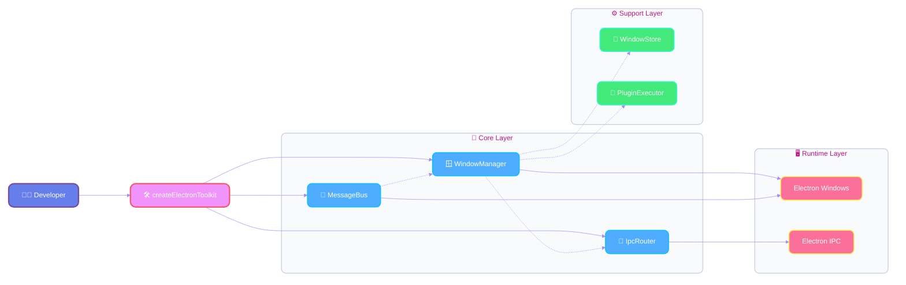

# Electron Infra Kit

[](https://www.npmjs.com/package/electron-infra-kit)
[](https://www.npmjs.com/package/electron-infra-kit)
[](https://github.com/chunhaofen/electron-infra-kit/actions/workflows/ci.yml)
[](https://github.com/chunhaofen/electron-infra-kit/blob/master/LICENSE)
[](https://www.typescriptlang.org/)

English | [简体中文](./README.zh-CN.md)

A comprehensive infrastructure kit for Electron applications, providing window management, IPC routing, and state synchronization capabilities.

## ✨ Features

- 🪟 **Window Manager** - Lifecycle management, state persistence, plugin system
- 🔌 **IPC Router** - Type-safe communication with dependency injection
- 🌉 **Message Bus** - Real-time state sync across windows via MessageChannel
- ⚙️ **Config Manager** - Persistent configuration with Zod validation
- 🐛 **Debug Tools** - Performance monitoring and development utilities
- 📋 **Type Safety** - Full TypeScript support with runtime validation

## 📦 Installation

```bash
npm install electron-infra-kit
# or
pnpm add electron-infra-kit
```

**Requirements**: Electron >= 22.0.0, TypeScript >= 5.0.0, Node.js >= 18.0.0

## 🚀 Quick Start

```typescript
import { app } from 'electron';
import { createElectronToolkit } from 'electron-infra-kit';

app.whenReady().then(async () => {
  // Initialize kit
  const { windowManager, ipcRouter, messageBus } = createElectronToolkit({
    isDevelopment: process.env.NODE_ENV === 'development',
  });

  // Wait for initialization
  await windowManager.ready();

  // Create window
  await windowManager.create({
    name: 'main',
    title: 'My App',
    width: 1024,
    height: 768,
  });
});
```

**That's it!** You now have:

- ✅ Window management with state persistence
- ✅ Type-safe IPC communication
- ✅ Cross-window state synchronization
- ✅ Performance monitoring (in dev mode)

## 📖 Documentation

### Getting Started

- **[Quick Start Guide](./QUICKSTART.md)** - Get up and running in 5 minutes
- **[Complete Example](./guides/COOKBOOK.md)** - Full working example with all features
- **[Migration Guide](./IMPROVEMENTS.md)** - Upgrade from older versions

### Core Concepts

- **[Window Manager](./guides/core/window/README.md)** - Window lifecycle and management
- **[IPC Router](./guides/core/ipc/README.md)** - Type-safe inter-process communication
- **[Message Bus](./guides/core/message-bus/README.md)** - State synchronization
- **[Lifecycle Manager](./guides/core/lifecycle/README.md)** - Application lifecycle

### Advanced Topics

- **[Type Safety Guide](./guides/type-safety/TYPE_SAFETY.md)** - TypeScript best practices
- **[Performance Optimization](./guides/performance/PERFORMANCE.md)** - Tips and tricks
- **[Error Handling](./guides/infrastructure/errors/ERROR_HANDLING.md)** - Robust error management
- **[Debugging](./guides/infrastructure/debug/README.md)** - Development tools

### API Reference

- **[Full API Documentation](./guides/README.md)** - Complete API reference
- **[Type Definitions](./src/types.ts)** - TypeScript types

## 💡 Key Concepts

### Architecture Design



### Window Manager

<details>
<summary><b>Architecture Diagram</b></summary>

```
                                  ┌───────────────────┐
                                  │   WindowStore     │
                                  │   (Core Facade)   │
                                  └─────────┬─────────┘
                                            │
           ┌────────────────┬───────────────┼─────────────────┐
           ▼                ▼               ▼                 ▼
    ┌────────────┐   ┌────────────┐  ┌──────────────┐  ┌──────────────┐
    │  Registry  │   │  Operator  │  │ StateManager │  │ ContextMgr   │
    │ (Storage)  │   │ (Actions)  │  │ (Persistence)│  │ (Ctx Data)   │
    └────────────┘   └────────────┘  └──────────────┘  └──────────────┘

                                            ▲
                                            │ composes
                                            │
                                  ┌─────────┴─────────┐
                                  │   WindowManager   │
                                  │ (High-Level API)  │
                                  └─────────┬─────────┘
                                            │
                                            ▼
                                     ┌──────────────┐
                                     │   Plugins    │
                                     │ & Lifecycle  │
                                     └──────────────┘
```

</details>

```typescript
// Create and manage windows
const windowId = await windowManager.create({
  name: 'editor',
  width: 800,
  height: 600,
});

// Close window (new unified API)
windowManager.close(windowId);
```

### IPC Router

<details>
<summary><b>Architecture Diagram</b></summary>

```
Renderer Process                      Main Process
┌──────────────────────┐          ┌─────────────────────────────────────┐
│                      │          │                                     │
│  ipcRenderer.invoke  │─────────►│  ipcMain.handle('channel')          │
│   (name, data)       │          │            │                        │
│                      │          │            ▼                        │
│                      │          │      ┌─────────────┐                │
│                      │          │      │  IpcRouter  │                │
│                      │          │      └─────────────┘                │
│                      │          │            │                        │
│                      │          │    1. Validate Request (Zod)        │
│                      │          │    2. Find Handler by 'name'        │
│                      │          │    3. Inject API (DI Container)     │
│                      │          │            │                        │
│                      │          │            ▼                        │
│                      │          │      ┌─────────────┐                │
│                      │          │      │ IpcHandler  │                │
│                      │          │      │ (Business)  │◄── APIs        │
│                      │          │      └─────────────┘                │
│                      │          │            │                        │
│                      │          │            ▼                        │
│                      │          │      Return Result                  │
│                      │          │    (Promise<Result>)                │
│                      │          │                                     │
└──────────────────────┘          └─────────────────────────────────────┘
```

</details>

```typescript
// Define type-safe handlers
const handler = new IpcHandler(
  'getUser',
  'user',
  async (context, payload: { id: string }) => {
    return { id: payload.id, name: 'User' };
  },
  z.object({ id: z.string() })
);

ipcRouter.addHandler(handler);
```

### Message Bus

<details>
<summary><b>Architecture Diagram</b></summary>

```
      Main Process                          Renderer Process
┌─────────────────────────────┐          ┌──────────────────────┐
│         MessageBus          │          │       Window A       │
│      (Shared Instance)      │          │ (MessagePort Client) │
│                             │◄──IPC────┤                      │
│  ┌───────────────────────┐  │          │      Local Cache     │
│  │ DataStore (Map)       │  │          └──────────▲───────────┘
│  │ - key: value          │  │                     │
│  │ - permission          │  │                     │
│  └──────────▲────────────┘  │                     │
│             │               │          ┌──────────▼───────────┐
│  ┌──────────▼────────────┐  │          │       Window B       │
│  │ MessageDispatcher     │──┼─Broadcast│ (MessagePort Client) │
│  └──────────┬────────────┘  │─────────►│                      │
│             │               │          │      Local Cache     │
│  ┌──────────▼────────────┐  │          └──────────────────────┘
│  │ WindowPorts (Map)     │  │
│  │ - winId: MessagePort  │  │
│  └───────────────────────┘  │
└─────────────────────────────┘
```

</details>

```typescript
// Sync state across windows
messageBus.setData('theme', 'dark');

// Watch for changes (remember to unsubscribe!)
const unsubscribe = messageBus.watch('theme', (newValue) => {
  console.log('Theme changed:', newValue);
});
```

## 🎯 Use Cases

- **Multi-window IDEs** - Code editors with multiple panels
- **Design Tools** - Apps with canvas, properties, and toolbars
- **Collaboration Apps** - Real-time state sync across windows
- **Enterprise Apps** - Large-scale applications with complex workflows

## 🏗️ Architecture

```
┌─────────────────────────────────────────┐
│         LifecycleManager                │
│    (Orchestrates everything)            │
└─────────────────────────────────────────┘
                  │
    ┌─────────────┼─────────────┐
    ▼             ▼             ▼
┌─────────┐  ┌─────────┐  ┌─────────┐
│ Window  │◄─┤   IPC   │◄─┤ Message │
│ Manager │  │ Router  │  │   Bus   │
└─────────┘  └─────────┘  └─────────┘
```

**Design Principles**:

- 🎯 Separation of Concerns - Each module has a single responsibility
- 🔒 Type Safety First - Full TypeScript support with runtime validation
- ⚡ Performance Optimized - MessageChannel-based communication
- 🔌 Extensible - Plugin system for custom functionality
- 🛡️ Secure by Default - Context isolation and sandboxing

## 📂 Directory Structure

```
electron-infra-kit/
├── src/                    # Source code
│   ├── core/               # Core modules
│   │   ├── window/         # Window Manager
│   │   ├── ipc/            # IPC Router
│   │   ├── message-bus/    # Message Bus
│   │   └── lifecycle/      # Lifecycle Manager
│   ├── infrastructure/     # Infrastructure modules
│   │   ├── config/         # Configuration
│   │   ├── debug/          # Debugging tools
│   │   ├── errors/         # Error handling
│   │   └── logger/         # Logging
│   └── preload/            # Preload scripts
├── examples/               # Example projects
└── guides/                 # Documentation
```

## 🤝 Contributing

We welcome contributions! See [DEVELOPMENT.md](./DEVELOPMENT.md) for:

- Development setup
- Coding standards
- Commit conventions
- Release process

## 📄 License

[MIT](./LICENSE) © [chunhaofen](https://github.com/chunhaofen)

---

## 🔗 Links

- **[GitHub Repository](https://github.com/chunhaofen/electron-infra-kit)**
- **[npm Package](https://www.npmjs.com/package/electron-infra-kit)**
- **[Issue Tracker](https://github.com/chunhaofen/electron-infra-kit/issues)**
- **[Changelog](./CHANGELOG.md)**
- **[Official Example](https://github.com/chunhaofen/electron-infra-showcase)**

## ⭐ Star History

If you find this project helpful, please consider giving it a star! ⭐

---

**Made with ❤️ for the Electron community**
