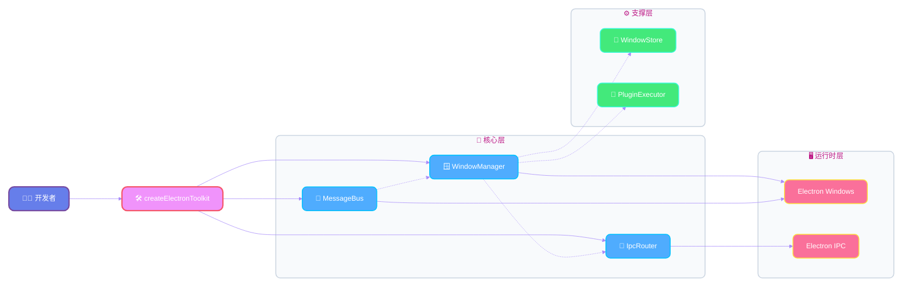

# Electron Infra Kit

[](https://www.npmjs.com/package/electron-infra-kit)
[](https://www.npmjs.com/package/electron-infra-kit)
[](https://github.com/chunhaofen/electron-infra-kit/actions/workflows/ci.yml)
[](https://github.com/chunhaofen/electron-infra-kit.git/blob/main/LICENSE)
[](https://www.typescriptlang.org/)

[English](./README.md) | 简体中文

为 Electron 应用打造的综合基础设施工具包，提供窗口管理、IPC 路由和状态同步功能。

## ✨ 特性

- 🪟 **窗口管理器** - 生命周期管理、状态持久化、插件系统
- 🔌 **IPC 路由** - 类型安全的通信，支持依赖注入
- 🌉 **消息总线** - 基于 MessageChannel 的跨窗口实时状态同步
- ⚙️ **配置管理器** - 持久化配置，支持 Zod 验证
- 🐛 **调试工具** - 性能监控和开发工具
- 📋 **类型安全** - 完整的 TypeScript 支持和运行时验证

## 📦 安装

```bash
npm install electron-infra-kit
# 或
pnpm add electron-infra-kit
```

**依赖要求**: Electron >= 22.0.0, TypeScript >= 5.0.0, Node.js >= 18.0.0

## 🚀 快速开始

```typescript
import { app } from 'electron';
import { createElectronToolkit } from 'electron-infra-kit';

app.whenReady().then(async () => {
  // 初始化工具包
  const { windowManager, ipcRouter, messageBus } = createElectronToolkit({
    isDevelopment: process.env.NODE_ENV === 'development',
  });

  // 等待初始化完成
  await windowManager.ready();

  // 创建窗口
  await windowManager.create({
    name: 'main',
    title: '我的应用',
    width: 1024,
    height: 768,
  });
});
```

**就这么简单！** 你现在拥有：

- ✅ 带状态持久化的窗口管理
- ✅ 类型安全的 IPC 通信
- ✅ 跨窗口状态同步
- ✅ 性能监控（开发模式）

## 📖 文档

### 入门指南

- **[快速开始](./QUICKSTART.zh-CN.md)** - 5分钟快速上手
- **[完整示例](./guides/COOKBOOK.zh-CN.md)** - 包含所有功能的完整示例
- **[迁移指南](./IMPROVEMENTS.md)** - 从旧版本升级

### 核心概念

- **[窗口管理器](./guides/core/window/README.zh-CN.md)** - 窗口生命周期和管理
- **[IPC 路由](./guides/core/ipc/README.zh-CN.md)** - 类型安全的进程间通信
- **[消息总线](./guides/core/message-bus/README.zh-CN.md)** - 状态同步
- **[生命周期管理器](./guides/core/lifecycle/README.zh-CN.md)** - 应用生命周期

### 进阶主题

- **[类型安全指南](./guides/type-safety/TYPE_SAFETY.zh-CN.md)** - TypeScript 最佳实践
- **[性能优化](./guides/performance/PERFORMANCE.zh-CN.md)** - 技巧和窍门
- **[错误处理](./guides/infrastructure/errors/ERROR_HANDLING.zh-CN.md)** - 健壮的错误管理
- **[调试](./guides/infrastructure/debug/README.zh-CN.md)** - 开发工具

### API 参考

- **[完整 API 文档](./guides/README.zh-CN.md)** - 完整的 API 参考
- **[类型定义](./src/types.ts)** - TypeScript 类型

## 💡 核心概念


### 架构设计




### 窗口管理器

<details>
<summary><b>架构图</b></summary>

```
                                  ┌───────────────────┐
                                  │   WindowStore     │
                                  │   (核心门面)       │
                                  └─────────┬─────────┘
                                            │
           ┌────────────────┬───────────────┼─────────────────┐
           ▼                ▼               ▼                 ▼
    ┌────────────┐   ┌────────────┐  ┌──────────────┐  ┌──────────────┐
    │  Registry  │   │  Operator  │  │ StateManager │  │ ContextMgr   │
    │  (存储)     │   │  (操作)     │  │  (持久化)     │  │ (上下文数据)  │
    └────────────┘   └────────────┘  └──────────────┘  └──────────────┘

                                            ▲
                                            │ 组合
                                            │
                                  ┌─────────┴─────────┐
                                  │   WindowManager   │
                                  │   (高级 API)       │
                                  └─────────┬─────────┘
                                            │
                                            ▼
                                     ┌──────────────┐
                                     │   Plugins    │
                                     │ & Lifecycle  │
                                     └──────────────┘
```

</details>

```typescript
// 创建和管理窗口
const windowId = await windowManager.create({
  name: 'editor',
  width: 800,
  height: 600,
});

// 关闭窗口（新的统一 API）
windowManager.close(windowId);
```

### IPC 路由

<details>
<summary><b>架构图</b></summary>

```
渲染进程 (Renderer)                   主进程 (Main)
┌──────────────────────┐          ┌─────────────────────────────────────┐
│                      │          │                                     │
│  ipcRenderer.invoke  │─────────►│  ipcMain.handle('channel')          │
│   (name, data)       │          │            │                        │
│                      │          │            ▼                        │
│                      │          │      ┌─────────────┐                │
│                      │          │      │  IpcRouter  │                │
│                      │          │      └─────────────┘                │
│                      │          │            │                        │
│                      │          │    1. 验证请求 (Zod)                 │
│                      │          │    2. 查找处理器 ('name')            │
│                      │          │    3. 注入 API (DI 容器)             │
│                      │          │            │                        │
│                      │          │            ▼                        │
│                      │          │      ┌─────────────┐                │
│                      │          │      │ IpcHandler  │                │
│                      │          │      │  (业务逻辑)  │◄── APIs        │
│                      │          │      └─────────────┘                │
│                      │          │            │                        │
│                      │          │            ▼                        │
│                      │          │       返回结果                       │
│                      │          │    (Promise<Result>)                │
│                      │          │                                     │
└──────────────────────┘          └─────────────────────────────────────┘
```

</details>

```typescript
// 定义类型安全的处理器
const handler = new IpcHandler(
  'getUser',
  'user',
  async (context, payload: { id: string }) => {
    return { id: payload.id, name: '用户' };
  },
  z.object({ id: z.string() })
);

ipcRouter.addHandler(handler);
```

### 消息总线

<details>
<summary><b>架构图</b></summary>

```
       主进程 (Main)                         渲染进程 (Renderer)
┌─────────────────────────────┐          ┌──────────────────────┐
│         MessageBus          │          │       窗口 A         │
│        (共享实例)            │          │ (MessagePort Client) │
│                             │◄──IPC────┤                      │
│  ┌───────────────────────┐  │          │      本地缓存         │
│  │ DataStore (Map)       │  │          └──────────▲───────────┘
│  │ - key: value          │  │                     │
│  │ - permission          │  │                     │
│  └──────────▲────────────┘  │                     │
│             │               │          ┌──────────▼───────────┐
│  ┌──────────▼────────────┐  │          │       窗口 B         │
│  │ MessageDispatcher     │──┼─广播─────│ (MessagePort Client) │
│  └──────────┬────────────┘  │─────────►│                      │
│             │               │          │      本地缓存         │
│  ┌──────────▼────────────┐  │          └──────────────────────┘
│  │ WindowPorts (Map)     │  │
│  │ - winId: MessagePort  │  │
│  └───────────────────────┘  │
└─────────────────────────────┘
```

</details>

```typescript
// 跨窗口同步状态
messageBus.setData('theme', 'dark');

// 监听变化（记得取消订阅！）
const unsubscribe = messageBus.watch('theme', (newValue) => {
  console.log('主题变更:', newValue);
});
```

## 🎯 适用场景

- **多窗口 IDE** - 带有多个面板的代码编辑器
- **设计工具** - 包含画布、属性和工具栏的应用
- **协作应用** - 跨窗口实时状态同步
- **企业应用** - 具有复杂工作流的大型应用

## 🏗️ 架构

```
┌─────────────────────────────────────────┐
│         LifecycleManager                │
│         (编排所有模块)                   │
└─────────────────────────────────────────┘
                  │
    ┌─────────────┼─────────────┐
    ▼             ▼             ▼
┌─────────┐  ┌─────────┐  ┌─────────┐
│ Window  │◄─┤   IPC   │◄─┤ Message │
│ Manager │  │ Router  │  │   Bus   │
└─────────┘  └─────────┘  └─────────┘
```

**设计原则**:

- 🎯 关注点分离 - 每个模块都有单一职责
- 🔒 类型安全优先 - 完整的 TypeScript 支持和运行时验证
- ⚡ 性能优化 - 基于 MessageChannel 的通信
- 🔌 可扩展 - 插件系统支持自定义功能
- 🛡️ 默认安全 - 上下文隔离和沙箱机制

## 📂 目录结构

```
electron-infra-kit/
├── src/                    # 源代码
│   ├── core/               # 核心模块
│   │   ├── window/         # 窗口管理器
│   │   ├── ipc/            # IPC 路由
│   │   ├── message-bus/    # 消息总线
│   │   └── lifecycle/      # 生命周期管理器
│   ├── infrastructure/     # 基础设施模块
│   │   ├── config/         # 配置管理
│   │   ├── debug/          # 调试工具
│   │   ├── errors/         # 错误处理
│   │   └── logger/         # 日志记录
│   └── preload/            # 预加载脚本
├── examples/               # 示例项目
└── guides/                 # 文档指南
```

## 🤝 贡献

欢迎提交贡献！请查看 [DEVELOPMENT.md](./DEVELOPMENT.md) 了解：

- 开发环境设置
- 代码规范
- 提交规范
- 发布流程

## 📄 许可证

[MIT](./LICENSE) © [chunhaofen](https://github.com/chunhaofen)

---

## 🔗 链接

- **[GitHub 仓库](https://github.com/chunhaofen/electron-infra-kit)**
- **[npm 包](https://www.npmjs.com/package/electron-infra-kit)**
- **[问题追踪](https://github.com/chunhaofen/electron-infra-kit/issues)**
- **[更新日志](./CHANGELOG.md)**

## ⭐ Star 历史

如果这个项目对你有帮助，请考虑给它一个 star！⭐

---

**用 ❤️ 为 Electron 社区打造**
