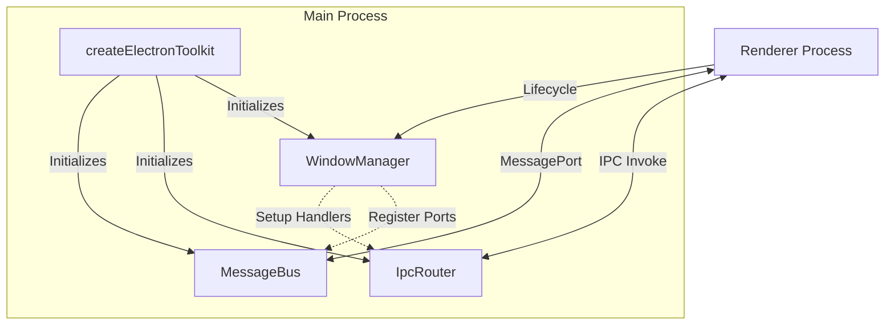

# Module Guides

[English](./README.md) | [简体中文](./README.zh-CN.md)

Complete documentation for all modules in Electron Infra Kit.

## 📚 Available Guides

### Core Modules (`src/core/`)

- **[Window Manager](./core/window/README.md)** - Window lifecycle management (registry & plugins)
- **[IPC Router](./core/ipc/README.md)** - Dependency injection based IPC handler system
- **[Message Bus](./core/message-bus/README.md)** - Multi-window state synchronization based on MessageChannel
- **[Lifecycle Manager](./core/lifecycle/README.md)** - Centralized lifecycle orchestration for kit modules

### Infrastructure (`src/infrastructure/`)

- **[Logger](./infrastructure/logger/README.md)** - Environment-aware logging utility
- **[Config Manager](./infrastructure/config/README.md)** - Type-safe persistent configuration management
- **[Error Handling](./infrastructure/errors/ERROR_HANDLING.md)** - Unified error handling system
- **[Debug Tools](./infrastructure/debug/README.md)** - Development debugging and performance monitoring tools

### Internal (`src/internal/`)

> Note: These modules are internal implementations and not intended for direct use.

- **[Utils](./internal/utils/README.md)** - Internal utility classes and helper functions
- **[Types](./internal/types/README.md)** - Internal type definitions

### Others

- **[IPC Transport](./core/ipc/transport/README.md)** - Low-level IPC communication primitives
- **[Preload](./preload/README.md)** - Secure renderer process API bridge
- **[Type Safety](./type-safety/TYPE_SAFETY.md)** - Guide to the type system

### Core Toolkit Helpers

In addition to individual modules, the kit provides several **core helpers** exported from the package root (`electron-infra-kit`):

- **`createElectronToolkit(config?: WindowManagerConfig)`**  
  One-stop initializer that creates and wires together:
  - `windowManager` – high-level window lifecycle manager (with optional IPC integration)
  - `ipcRouter` – dependency-injected IPC handler hub in the main process
  - `messageBus` – multi-window state sync bridge based on `MessageChannel`

  It will:
  - Clone the passed `config` to avoid side effects
  - Inject a default `ipcSetup` implementation when not provided (using `IpcSetup.defaultSetup`)
  - Automatically bind `window-will-be-destroyed` events to clean up `MessageBus` ports
  - Enable **debug mode** automatically when `config.isDevelopment` is true or `NODE_ENV=development`
  - Accept `loggerOptions` to configure the shared logger (e.g. `ipcEnabled`, `ipcLevel`)

- **`DebugHelper`**  
  Debug utility designed for development:
  - `DebugHelper.enableDebugMode()` enables verbose logging and sets `process.env.ELECTRON_TOOLKIT_DEBUG = 'true'`
  - In the main process, it exposes `global.__ELECTRON_TOOLKIT_DEBUG__` with:
    - `instances` – a registry for debug targets
    - `listInstances()` – list all registered instance names
    - `getInstance(name)` – retrieve a specific instance for inspection in REPL/DevTools
  - `DebugHelper.register(name, instance)` registers internal objects (e.g. `windowManager`, `ipcRouter`, `messageBus`).

- **`Types`**  
  Re-exports all major TypeScript types in a single place:
  - Window-related: `WindowManagerConfig`, `WindowCreationOptions`, etc.
  - IPC-related: `IpcRequest`, `IpcDefinition`, transport types
  - Message bus types: `DataChangeEvent`, `FieldPermission`, etc.
  - Preload types: `PreloadConfig`, `IpcRendererBindings`
  - Logger types: `ILogger`

  **Usage example:**

  ```ts
  import { Types } from 'electron-infra-kit';

  function createConfig(): Types.WindowManagerConfig {
    return {
      /* ... */
    };
  }
  ```

- **Utility helpers**  
  Currently the kit ships a minimal utility:
  - `delay(ms: number): Promise<void>` – a simple Promise-based sleep helper, useful in examples, tests, or staged window flows.

## System Architecture

The three core modules work together to form a cohesive infrastructure:



1. **WindowManager**: The central coordinator. It manages window lifecycle and ensures other modules are properly connected to windows (e.g., registering MessageBus ports when windows are created).
2. **IpcRouter**: Handles command-response communication. It provides API endpoints for the renderer to request actions from the main process.
3. **MessageBus**: Handles state synchronization. It keeps data in sync across all windows using efficient peer-to-peer style broadcasting.

## 🚀 Quick Links

- [Main README](../README.md)
- [Development Guide](../DEVELOPMENT.md)
- [API Documentation](../docs/api/)

## 📖 How to Use These Guides

Each module guide includes:

1. **Overview** - What the module does and why you need it
2. **Features** - Key capabilities and benefits
3. **Architecture** - Design patterns and structure
4. **Usage** - Code examples and best practices
5. **API Reference** - Complete API documentation

## 🌍 Language Support

All guides are available in:

- English (README.md)
- Simplified Chinese (README.zh-CN.md)
